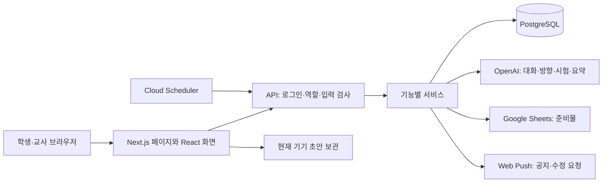

# 플랫폼 구조 점검과 단계별 개선 계획

작성: 2026-09-07 · 과탐실·동아리 공통 · 운영 배포 보류

## A. Executive Summary

**현재 평가: 6.5/10. 처음부터 다시 만들 필요는 없으며, 기존 구조를 유지한 단계적 개선을 권한다.** 이 점수는 코드·테스트·작업 기록을 바탕으로 한 유지보수 관점의 판단이지, 보안 인증이나 장애율 측정값은 아니다.

기능별 서버 파일, 학생·교사 화면, 관계형 데이터베이스라는 기본 틀은 이해하기 쉽다. 문서 이력, 교사 승인, 동아리 설정 버전, 비식별 AI 입력처럼 유지할 가치가 있는 장치도 있다. 위험은 기본 기술 선택보다 **서로 다른 기능에서 저장·권한·실패 처리를 조금씩 다르게 구현한 것**에 집중된다.

이번에는 전체 파일 목록, 데이터베이스 스키마, 인증, API 권한 조건, 문서·일지·준비물 저장, 동아리 설정, AI 대화·요약·시험, 알림, 테스트·배포 설정을 조사하고 주요 경로를 코드로 추적했다. 조사 시작 시 `src`에는 160개 파일, API route 파일은 40개, 자동 테스트 파일은 28개였다. 큰 서비스의 모든 분기를 실제 사용자 조합으로 실행한 전수 검증은 아니다.

판단을 다음처럼 구분한다.

- **재현 확인:** 수정 전 브라우저에서 계획서·일지의 늦은 저장 응답이 새 글을 지움. 추가 탭은 보관된 팀에서도 조회가 성공함. 일부 API는 비밀번호 변경 필수 상태를 차단하지 않음. DB 초기화 실패 후 정리가 실행되지 않음.
- **코드 확인:** 팀·계획서·보고서의 1:1 관계, 만료 없는 AI 잠금, 준비물 재전송 시 원 작성자 대신 교사의 계정 유형 사용, 세션 토큰에 비밀번호 변경 버전이 없음 등.
- **미검증:** 실제 학생 기기·한글 입력기·절전, 운영 동시 접속 부하, 실제 PostgreSQL의 모든 경쟁 상황, 최신 의존성 보안 공지 전체 대조, 백업에서 별도 환경으로 복원하는 실습.

이미 로컬에서 고친 항목은 아래에 명시한다. **운영 사이트는 기존 리비전이며, 이 보고서의 수정 완료는 운영 반영 완료를 뜻하지 않는다.**

## B. 현재 Architecture



하나의 Next.js 앱 안에 화면과 서버가 함께 있는 구조다. 별도 백엔드나 마이크로서비스가 없어, 한 기능을 따라갈 때 주로 화면 → API → 서비스 → 테이블을 보면 된다.

| 위치 | 실제 역할 |
|---|---|
| `src/app` | 페이지, 로그인 진입, 학생·교사 경로, API |
| `src/components` | 입력·표시·상호작용, 서버 재조회, 초안 |
| `src/lib/*-service.ts` 및 기능 파일 | 문서·일지·평가·시험 등의 처리 규칙 |
| `src/lib/db/schema.ts`, `discussion-schema.ts` | 테이블·인덱스와 기존 데이터 보정 SQL |
| `src/lib/db/index.ts` | 최대 5개 연결 풀, 초기화, 로컬 예시 자료, 감사 기록 |
| `ai.ts`, `exam-ai.ts`, `discussion-summary.ts`, `ai-config.ts` | AI 입력·응답·모델·관측 로그 |
| `public/sw.js` | 푸시 표시·알림 클릭 이동. 전체 앱의 오프라인 캐시는 아님 |
| `Dockerfile`, `.gcloudignore`, `.dockerignore` | Cloud Run용 빌드와 민감 파일 제외 |

학생은 계정으로 로그인한 뒤 활동별 현재 팀을 선택한다. 팀의 탐구 세션에 대화·계획서·준비물·일지·보고서가 연결된다. 교사는 같은 자료를 역할별 화면에서 확인하고 승인·피드백·시험 확정·평가 공개를 수행한다. AI는 서버에서 호출하며, 현재 설정 발행이나 평가 공개 권한은 갖지 않는다.

## C. 잘 되어 있는 부분

1. **단일 앱과 기능별 파일 분리:** 작은 학교 서비스에서 변경 위치를 찾기 쉽다. 프레임워크·데이터베이스 교체의 이익이 현재 위험보다 크지 않다.
2. **서버 측 권한 검사:** UI만 숨기는 구조가 아니다. 현재 팀원, 교사, 동아리 담당자, 마스터를 서버에서 확인한다. 이번에 발견한 누락 조건을 보완하는 방식이 적절하다.
3. **기록 보존:** 팀·학생 제거를 비활성화와 보관으로 처리하고, 문서 변경 이력·설정 버전·시험 교정본을 남긴다.
4. **관계형 DB와 매개변수 쿼리:** 주요 조회는 입력값을 SQL 문자열에 직접 붙이지 않고 매개변수로 전달한다. 동적 테이블·열 이름은 고정된 코드 분기인지 별도로 확인해야 한다.
5. **AI 기능별 모델 설정:** `ai-config.ts`에 모델 선택 지점과 사용량 관측이 이미 있다. 새로운 모델 라우팅 프레임워크를 도입할 필요가 없다.
6. **AI 입력 보호:** 알려진 사용자 식별정보 치환, 요약의 근거 ID 검사, AI 제안과 학생 활동 구분, 시험의 학생별 근거 분리 장치가 있다. 치환만으로 완전한 익명화를 보장하지는 않는다.
7. **검증 자산:** 실제 기능·권한·과거 기록 보존 테스트가 존재한다. 이번 회귀 테스트를 여기에 추가했다.
8. **운영 기본 장치:** 영구 DB 없는 운영 실행을 거절하고, 비밀값을 서버에 둔다. 백업·삭제 보호는 기존 운영 기록으로 확인되며 이번 작업에서 재설정하지 않았다.

## D. 기술부채 Top 10

P0는 수업 중 손실·접근 규칙 위반을 우선 막을 항목, P1은 다음 기능 확장 전에 다룰 항목, P2는 안정화 후 선택적으로 개선할 항목이다. 같은 항목에서도 일부 원인만 수정했으면 남은 부분을 적었다.

### 1. P0 — 작성 중인 내용과 서버 응답의 경합

- **문제·근거:** `plan-editor.tsx`, `report-editor.tsx`의 이전 전체 상태 동기화와 `journal-panel.tsx`의 `finishSync`가 오래된 응답으로 새 입력을 덮어썼다. 계획서와 일지에서 수정 전 브라우저 실패를 확인했다.
- **영향·시점:** 수업 결과물 유실이므로 기능 확장보다 우선한다.
- **이번 수정:** 계획서·보고서 항목별 초안/버전, 저장 충돌 비교, 재시도. 일지 저장 중 추가 입력 보존, 서버 조회 실패와 기기 초안 복구 분리, 최신 초안 재전송, 내부 탭 이동 시 편집기 유지, 명시적 초안 폐기 확인. IndexedDB는 요청 성공이 아니라 트랜잭션 완료를 기다린다.
- **후속 정정 (2026-09-07):** 기기 복구용 초안은 계속 유지하되 서버 저장은 문서 전체의 `임시 저장` 버튼으로 실행한다. 항목 이탈·화면 전환·연결 복구만으로 작성 내용을 서버에 보내지 않는다. 버튼을 누른 순간의 값만 전송하고 이후 추가 입력은 다음 임시 저장 전까지 초안으로 남는다. 이는 기존 기록 삭제나 미저장 글 자동 폐기를 의미하지 않는다.
- **후속 폼 수정 (2026-09-07):** 준비물·동아리 추가 탭·자기/동료평가의 복구용 초안과 명시적 저장 재시도를 적용했다. 평가 대상 전환과 저장 완료 시각 변경으로 인한 글 유실을 막고, 마감된 평가의 제출본과 미제출 초안을 구분한다. 닫힌 이전 폼의 저장 완료는 새 초안을 지우지 않는다.
- **후속 충돌 수정 (2026-09-07):** 추가 탭·자기/동료평가의 저장 번호 검사와 학생 비교 화면을 추가했다. 충돌 시 초안과 당시 저장 번호를 보존하고, 비교 선택 후 명시적 저장으로만 반영한다. 해당 교사 검토에도 같은 번호 검사를 적용했다.
- **남음:** 일지의 다중 기기 동시 수정, 교사 평가 종합 의견·공개 전체의 경합. 준비물 전송 순서·응답 유실은 아래 Goal 후속 수정에 반영했다. 브라우저 복구용 초안은 영구 백업이 아니며 실제 PostgreSQL과 학생 기기 검증도 남아 있다.
- **난이도/변경 위험:** 중간/중간. 사진 추가·삭제, 한글 조합, 느린 응답, 중복 재전송을 함께 검증해야 한다.

### 2. P0 — 동일한 접근 규칙의 적용 누락

- **문제·근거:** 주제 선택·제안, 계획서 잠금, 명단, 시험·PDF·내보내기·준비물 재전송 API의 일부 처리에 `mustChangePassword` 검사가 없었다. `club-custom-tabs.ts`의 `context`는 팀원 여부는 보지만 팀 보관 상태를 보지 않았다.
- **영향·시점:** 임시 비밀번호 변경 전에도 보호된 작업을 호출하거나 보관 팀의 탭에 접근할 수 있었다. 기존 확정 규칙 위반이므로 즉시 보완한다. 비로그인 외부인이 모든 자료를 읽을 수 있다는 뜻은 아니다.
- **이번 수정:** 13개 API 처리 경로에 필수 비밀번호 변경 검사. 추가 탭 조회·저장에 활성 팀 조건. 차단 회귀 테스트와 정상 교사 접근 테스트 추가.
- **남음:** 인증·팀·담당자 검사를 작은 공통 함수로 정리하고, 모든 API에 대한 권한 조합 표를 유지한다.
- **난이도/변경 위험:** 낮음/낮음. 기존 규칙을 적용하며 새 권한 정책을 만들지 않는다.

### 3. P1 — 준비물의 재전송·소유권·외부 동기화

- **문제·근거:** `materials.ts`의 `retryMaterialSync`가 교사 ID를 `saveAndSyncMaterials`에 전달하므로 원 제출자가 체험 학생이어도 교사의 일반 계정 유형으로 시트 전송을 판단했다. `submission_id` 충돌 갱신에는 기존 신청의 팀·세션 소유권 조건이 없고, 저장된 설정 버전과 실제 재전송 시 읽는 최신 설정이 다를 수 있다. `google-sheets.ts`의 일반 동아리 경로는 append 방식이다.
- **영향·시점:** 연습 자료의 운영 시트 혼입, 재전송 중복, 설정 변경 뒤 잘못된 탭으로 전송할 가능성. 이미 사용하는 연동이므로 다음 확장 전에 다룬다.
- **이번 수정:** 원 제출자의 체험 계정 제외에 더해 팀·세션 소유권 및 조건부 갱신, 요청에 고정된 발행/보관 설정 사용, 재전송 시 원 제출자·제출 시각·금액·예산 상태 유지, 정상 반영된 동일 요청의 재전송 생략을 구현했다. 이전 전송 완료가 더 새 품목의 실패 상태를 성공으로 바꾸지 않도록 했다. 준비물 화면의 기기 초안·신청 ID 복구와 연결 실패 후 버튼 복구도 추가했다. 외부 호출을 대체한 테스트로 확인했다.
- **Goal 후속 수정 (2026-09-07):** 전송 스냅샷·작업 ID·고정 배치와 DB 문서별 예약을 구현했다. 조별 행 추가·입력·완료 ID를 한 배치로 적용하며, 일반 표는 탐구별 이름 있는 범위를 재사용한다. 완료 ID 중복으로 전체 배치를 거절하고 재조회하므로 응답 유실 재시도의 중복 쓰기를 방지한다. 자유 문자열은 stringValue로만 입력한다. 외부 네트워크 중 열린 DB 트랜잭션은 없으며, 미확인 전송 예약은 자동 만료하지 않는다.
- **남음:** 과거 위치·완료 기록이 없는 신청은 자동 재전송하지 않는다. 최종 배포 전에 실제 시트 대조·이행/복구 절차와 PostgreSQL 동시 실행을 검증한다. 사용자가 직접 행 구조나 완료 범위를 삭제하는 상황까지 자동 복구한다고 보장하지 않는다. 실제 시트에는 이번 검증 데이터를 쓰지 않았다.
- **API 근거:** Sheets는 배치 요청 전체를 원자적으로 반영하고, 이미 있는 namedRangeId 추가를 오류로 처리한다. 이를 영구 전송 ID로 사용하며 자동 삭제하지 않는다. [batchUpdate](https://developers.google.com/workspace/sheets/api/reference/rest/v4/spreadsheets/batchUpdate), [AddNamedRangeRequest](https://developers.google.com/workspace/sheets/api/reference/rest/v4/spreadsheets/request#AddNamedRangeRequest).
- **난이도/변경 위험:** 중간~높음/중간~높음. 실제 시트의 기존 조별 영역·합계·행 추가 규칙을 바꾸지 않도록 해야 한다.

### 4. P1 — AI 작업이 중단되면 남는 잠금과 재요청 비용

- **문제·근거:** `ai.ts`의 `lockAi`는 만료 없는 `ai_busy` 불리언이다. `finally`는 정상적인 예외에는 실행되지만 실행 환경이 종료되면 실행되지 않는다. `exam-service.ts`는 전체 생성 결과를 얻은 뒤 저장하고, 요청별 재사용 ID나 진행 중 작업의 복구 기록이 없다.
- **영향·시점:** 팀 대화가 계속 ‘답변 중’이거나 실패한 시험을 다시 만들 때 앞서 성공한 생성까지 반복할 수 있다. 실제 발생 빈도·비용은 이번에 측정하지 않았다.
- **제안:** 기존 `discussion-summary.ts`의 소유 토큰·만료·재시도 패턴을 참고한다. 오래된 요청의 종료가 새 요청 잠금을 풀지 않도록 토큰을 비교한다. AI 작업 저장은 사용자 메시지 저장과 분리한다.
- **난이도/변경 위험:** 중간/중간. 스키마 추가와 장애 중단 테스트가 필요하며 이번에 변경하지 않았다.

### 5. P1 — DB 초기화와 데이터 변경이 앱 기동에 결합

- **문제·근거:** `db/index.ts`는 최초 요청에서 전체 `SCHEMA_SQL`과 seed를 실행한다. `schema.ts`에는 DDL뿐 아니라 마스터 표시, 보고서 생성, 탐구 단계 보정도 들어 있다. 초기화 Promise가 한 번 실패하면 이후 요청도 같은 실패를 받던 문제도 있었다.
- **영향·시점:** 일시 장애가 지속 장애처럼 남거나 여러 실행 환경 시작 때 데이터 보정이 반복된다. 2-cycle 도입 전에 마이그레이션 경계를 정해야 한다.
- **이번 수정:** 실패한 연결 풀을 닫고 캐시된 초기화 실패를 해제해 다음 요청이 재시도하도록 했다. 동시 요청이 같은 초기화를 공유하는 것도 테스트했다.
- **남음:** 기존 SQL을 삭제하지 말고 적용 이력 테이블과 번호 있는 마이그레이션으로 점진적으로 옮긴다. 운영 전 실제 PostgreSQL과 별도 복원 환경에서 검증한다.
- **난이도/변경 위험:** 재시도 수정은 낮음/낮음, 마이그레이션 분리는 높음/높음.

### 6. P1 — 세션 취소와 외부 요청 방어의 빈틈

- **문제·근거:** `auth.ts`의 JWT는 사용자 ID와 1일 만료를 사용하고 현재 활성 계정을 재조회한다. 비밀번호 변경 시 토큰 버전은 바뀌지 않는다. 로그인 처리에는 앱 차원의 시도 제한이 없다. 푸시 구독 URL은 `https:`와 길이만 검사하고 이후 서버가 그 주소로 전송한다.
- **영향·시점:** 비밀번호를 변경해도 이전 토큰이 만료 전 재사용될 여지, 반복 로그인 시도, 의도하지 않은 서버 외부 요청 경로가 있다. 실제 공격이나 자료 유출을 확인한 것은 아니다.
- **제안:** 세션 버전 또는 서버 세션으로 비밀번호 변경·관리자 초기화 시 이전 세션 취소. 학급 공용 Wi-Fi를 고려해 IP만으로 학생 전체를 잠그지 않는 제한 설계. 실제 사용 브라우저의 푸시 제공자와 사설 주소 차단을 함께 검토한다.
- **난이도/변경 위험:** 중간/중간. 정상 학생의 동시 로그인·알림을 막지 않는 기준이 필요하다.

### 7. P1 — 2-cycle 저장 구조 (운영 전환 완료)

- **기존 문제:** 세션당 하나였던 계획서·보고서를 단순히 재사용하면 1차 자료와 승인 상태가 덮어써질 수 있었다.
- **이번 수정 (2026-09-08):** 탐구 세션 아래 순서가 있는 공통 Cycle을 두고, 대화·대면 기록·문서 이력·준비물·일지·계획서·보고서를 현재 Cycle에 연결했다. 완료 Cycle은 고정 근거 스냅샷과 이력으로 읽기 전용 보존하고 다음 Cycle의 계획서·보고서는 빈 초안으로 시작한다. 일지 번호도 Cycle별로 다시 1번부터 사용할 수 있다.
- **운영 확인 (2026-09-08):** 운영 PostgreSQL 16 백업 복원본에서 `0001~0005` 마이그레이션, 최초 3중 동시 기동, 회차 전환 경합과 기존 자료 불변성을 검증한 뒤 Cloud Run에 배포했다.
- **남음:** 실제 학생 기기에서 외부 사이트 복귀·한글 입력·절전 복귀와 Cycle 화면을 확인한다.
- **난이도/변경 위험:** 데이터 전환은 완료했다. 실제 기기 회귀는 낮음/중간이다.

### 8. P1 — 핵심 문서 이외의 변경 원자성과 버전 검사

- **문제·근거:** 기존 `ai.ts`의 `selectTopic`은 계획서 JSON 전체를 읽어 덮어쓰고 탐구 단계를 `EXPLORING`으로 설정하며, 일반 계획서 저장의 이력·재승인 경로를 거치지 않았다. 승인 유지·단계 후퇴·다른 팀원 잠금 무시를 합성 테스트로 재현했다. `teams.ts`의 과탐실 팀 이동은 여러 쿼리를 트랜잭션 없이 실행한다. `club-custom-tabs.ts`는 응답 전체를 갱신하며 최초 팀 응답의 `student_id`는 NULL이다.
- **영향·시점:** 동시에 변경하면 다른 항목·이력이 누락되거나 팀 관계가 중간 상태에 남을 수 있다. PostgreSQL의 NULL을 포함한 UNIQUE는 팀 공동 응답의 중복 행 방지 기준으로 충분하지 않다. 이번에는 실제 PostgreSQL 동시 실행으로 확인하지 않았다.
- **이번 수정:** 주제 선택을 `plan-service.ts`로 옮겨 같은 항목 저장·이력·잠금·재승인 규칙으로 통합했다. 새 화면의 기대 주제와 충돌하면 거절하고, 초기 단계만 탐색으로 진행하며 이미 진행한 단계는 되돌리지 않는다.
- **후속 수정 (2026-09-07):** 팀 공동 추가 탭의 첫 응답 ID를 작성 범위에서 결정해 기본 키 충돌로 중복 생성하지 않게 했다. 기존 응답 ID는 보존하며 과거 중복은 임의 정리하지 않고 확인 전 저장을 차단한다. 추가 탭·평가에 저장 번호를 추가하고 조건부 쓰기·교사 검토 검사·평가 회차 잠금을 적용했다. 2026-09-08 복원 검증 뒤 운영 스키마에 적용했다.
- **Goal 후속 수정 (2026-09-07):** 과탐실 팀 이동·팀장 해제·제거·지정·탐구 생성과 명단 배정을 트랜잭션에 묶고 학생→관련 팀 순서 잠금을 동아리/계정 비활성화와 공유한다. 이전 수업 팀장 표시 해제, 동아리 소속·과거 관계·비밀번호 보존, 기존 팀 ID 재사용을 합성 회귀 6개로 확인했다.
- **Goal 평가 공개 수정 (2026-09-07):** 교사 종합 피드백에 저장 번호를 추가하고, 익명 의견 검토·피드백·상태 변경·공개를 평가 회차 잠금으로 직렬화했다. 공개는 활성 학생과 팀을 공통 순서로 잠근 뒤 명단을 다시 읽고, 검토 상태·평균 조건·승인 의견·피드백·학생별 공개본·회차 상태를 한 트랜잭션에서 확정한다. 공개 재시도는 기존 스냅샷을 바꾸지 않고 공개 뒤 수정·재개를 차단한다. 교사 화면의 미저장 검토 문장은 복구 초안과 기준 번호를 유지하고 비교 선택만으로 서버에 쓰지 않는다.
- **남음:** 실제 PostgreSQL에서 열 추가·행 잠금·명단 변경과 공개의 동시 실행·배포 전환을 검증하고, 과거 중복이 실제로 발견되면 원문을 보존한 운영 정리 방침을 확정한다.
- **난이도/변경 위험:** 중간~높음/중간. 과거 기록·현재 팀장 규칙을 먼저 테스트로 고정한다.

### 9. P1 — AI 재현성과 전체 탐구 맥락 (Cycle 분석 로컬 해결)

- **기존 문제:** 최근 대화만으로는 여러 주의 탐구 맥락을 재현하기 어려웠고 중간·최종 분석의 입력과 출력 버전을 추적할 구조가 없었다.
- **이번 수정 (2026-09-08):** 중간/최종 분석을 별도 작업으로 만들고 회차 문서·역할·준비물·일지 관찰·대화 정리의 고정 근거와 해시, 모델, 프롬프트/스키마 버전, 작업 소유권과 완료 결과 재사용을 기록한다. 학생 판단은 필요한 제안에만 선택적으로 저장하며, 저장한 판단만 최종 분석에 전달한다.
- **남음:** 실제 모델 품질과 비용 비교는 합성 사례와 교사 평가표로 운영 전에 별도 확인한다.
- **난이도/변경 위험:** 구조 구현은 완료, 실제 모델 품질 검증은 중간/중간이다.

### 10. P2 — 큰 파일과 환경 의존적인 검증

- **문제·근거:** 조사 시작 시 `exam-service.ts` 873행, `evaluation-service.ts` 826행, `teacher-dashboard.tsx` 490행이었다. 타입·권한·조회·가공·쓰기 역할이 일부 서비스에 함께 있다. JSON 파싱·인증 거절·응답 오류 처리가 반복된다. `vitest.config.ts`는 서비스 테스트 중심이며 pg-mem은 실제 PostgreSQL과 완전히 같지 않다. 이번 준비물 테스트에서도 상관 서브쿼리 지원 차이를 만났다.
- **영향·시점:** AI가 한 파일을 수정하면서 관련 없는 동작을 건드리기 쉽다. 다만 파일 길이만으로 서비스가 고장 난 것은 아니므로 기능 안정화 후 진행한다.
- **이번 수정:** 테스트 실행 시 운영 DB·AI·Google·푸시 환경값이 시험 프로세스에 상속되지 않도록 격리했다. 실제 외부 계정에 접근하지 않는 재현 테스트를 추가했다.
- **제안:** 서비스의 조회·쓰기·AI 입력 준비를 필요에 따라 분리한다. UI는 화면 구역 단위로 추출한다. CI와 실제 PostgreSQL 계약 테스트, 브라우저 검증 실행 절차를 만든다. 쓰이지 않는 파일은 참조 검사와 기능 확인 전 삭제하지 않는다.
- **난이도/변경 위험:** 중간/중간. 전면 폴더 이동·범용 저장소 계층 도입은 피한다.

## E. 6주 탐구 Cycle 구조와의 호환성

**과탐실과 동아리 모두 같은 Cycle 모델을 사용하는 로컬 구현을 완료했다.** 활동 구분은 팀의 학급/동아리 소속으로 유지하고 Cycle은 탐구 세션의 하위에 둔다.

```text
팀 → 탐구 프로젝트(현재 inquiry_session)
       ├─ Cycle 1 → 계획서 → 실험/자료 → 중간 보고서
       │                         └─ 중간 AI 분석과 근거 스냅샷
       ├─ 필요한 제안만 학생이 선택적으로 수용·수정·선택하지 않음과 이유 저장
       └─ Cycle 2 → 후속 질문·계획서 → 실험/자료 → 최종 보고서
                                  └─ 최종 AI 분석과 근거 스냅샷
```

읽기 가능한 회차 모델 → 기존 자료 연결 → 회차별 계획·보고서 → 중간 분석 → 선택적 학생 판단 → 후속 탐구 → 최종 분석 순서로 구현했다. 기존 자료는 의미를 추정하지 않고 `기존 탐구 자료`로 연결하며 원문과 승인 상태를 유지한다.

각 Cycle은 계획서를 다시 승인받고 준비물·일지·보고서를 독립적으로 가진다. 새 중간보고서 구조를 만들지 않고 해당 Cycle 시작 시점의 기존 보고서 양식을 고정해 사용한다. 완료 Cycle은 읽기 전용이며 일지 차시는 Cycle마다 1번부터 다시 시작한다. Google Sheet 구조는 바꾸지 않는다.

## F. AI Architecture 평가

| 요구 | 현재 상태 | 권장 변경 |
|---|---|---|
| 모델 교체 | 기능별 환경 설정 가능 | 기존 `getAiRuntime` 유지 |
| 모델 routing | 대화/웹검색/주제/시험/일일 요약과 중간/최종 분석 구분 | 실제 운영 모델별 품질·비용 확인 |
| prompt version | 중간/최종 분석의 프롬프트·스키마 버전 기록 | 버전 변경 시 합성 평가 결과 연결 |
| 동일 작업 모델 비교 | 자동 비교 실행·판정 기록 없음 | 합성 탐구 사례와 교사 평가표로 같은 입력 비교 |
| 비용 추적 | 입력·출력·추론·캐시 토큰/웹검색 횟수 로그 | 작업별 예산·상한·취소·중복 방지. 가격은 별도 버전 있는 표로 계산 |
| 실패 fallback | 오류 안내/사용자 재시도, 요약 작업은 재시도 기록 | 출력 검증·재시도 후 실패 상태 보존. 고비용 모델로 무조건 자동 전환 금지 |
| structured output | 주제·시험·요약과 중간/최종 분석에 Zod 출력 형식 사용 | 운영 실패 사례를 합성 회귀로 추가 |
| 학생/교사 AI 분리 | 학생 대화와 교사 시험 생성 분리. 교사 도움말은 로컬 검색 | 공통 클라이언트가 권한 검사까지 대신하지 않도록 유지 |
| 학생 계획서 AI 검토 | 임시 저장된 특정 계획서 버전으로 질문·피드백 제공 | 실제 모델 품질 검증 |
| 교사 계획서 AI 검토 | 고정 제출본으로 검토 보조, 승인·피드백은 교사가 결정 | 실제 모델 품질 검증 |
| 중간/최종 분석 | 고정 근거·선택적 학생 판단·회차 비교 구현 | 실제 모델 품질과 운영 비용 검증 |

프롬프트는 기능별로 나누되 버전과 비교 기준을 관리하는 정도면 충분하다. OpenAI의 공식 문서도 프롬프트 버전과 평가를 연결하는 흐름을 안내한다. 당장 외부 프롬프트 관리 서비스를 도입해야 한다는 뜻은 아니다. [OpenAI Prompting](https://developers.openai.com/api/docs/guides/prompting)

중간 AI 분석은 분야/유형, 가설·변인·측정·결론 연결, 통제·교란·측정오차·반복측정, 일반화 한계, 안전·현실성, 후속 질문을 다룬다. 각 지적에는 입력 자료의 근거 ID, 확인 불가 사항, 학생에게 되물을 질문, 남은 기간에 가능한 선택지를 붙인다. 최종 분석은 두 회차 사이의 변경과 학생의 판단 이유를 비교하며, 자료에 없는 활동이나 역량을 추정하지 않는다.

## G. Database / Data Model 평가

| 개념 | 현재 | 확장 제안 |
|---|---|---|
| User / Teacher / Student | users와 role, 활성 상태, 계정 유형 | 유지. 세션 취소 버전은 별도 추가 검토 |
| Team | teams, team_members, 소속과 종료 이력 | 유지. 학급 또는 동아리 중 정확히 한 소속이라는 무결성 점검 |
| Inquiry Project | inquiry_sessions | 의미를 명확히 하고 당장 이름을 대량 변경하지 않음 |
| Inquiry Cycle | 순서·상태·시작/종료·양식 참조 구현 및 운영 배포 | 실제 학생 기기 회귀 |
| Submission / Plan / Report | 현재 문서와 Cycle별 불변 제출·분석 스냅샷 구분 | 운영 전환 검증 |
| Experiment / Dataset | 일지 텍스트·사진에 포함 | 필요 시 별도 실험·자료 엔터티. 원자료·단위·측정 조건·버전 유지 |
| AI Feedback / Analysis | 메시지·날짜별 요약과 분석 실행·고정 근거·모델/프롬프트 버전·결과·상태 | 실제 모델 품질 검증 |
| Teacher Feedback | 문서 현재 피드백과 변경 이력 | 회차·제출 버전 참조를 명시 |
| Student decision | 필요한 AI 제안에만 선택적으로 판단·이유·작성자·시각 기록 | 미응답을 추정하지 않는 규칙 유지 |
| Revision | document_revisions와 시험 교정본 | 유지. 분석이 참조한 버전은 최신값 변경과 분리 |

사진 BYTEA 저장은 현재 규모에서 동작한다. 파일 저장소로 옮기는 것은 실제 DB 용량·백업 크기·응답 지연을 측정한 뒤 판단한다. 측정 없이 즉시 분리하거나 기존 사진을 삭제하지 않는다.

테이블 이름 변경, 과거 데이터 일괄 변환, UNIQUE 해제는 이번에 실행하지 않았다. 마이그레이션에는 백업, 사전 무결성 점검, 기존 앱과의 호환 기간, 복구 절차가 필요하다.

## H. Security / Reliability

이번 작업의 검증은 로컬 합성 데이터와 외부 응답 대체를 사용했다. 운영 자료·비밀값·Google Sheet·계정 비밀번호는 변경하지 않았다. 브라우저 초안은 같은 기기 보관이며, 서버 백업이나 모든 기기 간 동기화를 대신하지 않는다.

남은 보안·신뢰성 확인 항목은 세션 취소/로그인 시도 제한, 푸시 외부 주소 제한, 모든 폼의 초안 수명·충돌, 준비물 소유권·재시도, 파일 크기 제한과 최신 라이브러리 취약점 대조다. `roster` 업로드는 파일 확장자를 검사하지만 요청 전체/행 수 제한은 추가 검토가 필요하다. 일반 서버 오류 메시지를 그대로 반환하는 경로도 사용자가 이해할 메시지와 내부 진단으로 나눠야 한다.

Google Sheets의 `USER_ENTERED`는 문자열을 셀 입력처럼 해석하고, `RAW`는 입력값을 그대로 저장한다. 현재 준비물의 계산식 생성 경로와 자유 입력값을 분리해 처리해야 한다. 합계 수식을 통째로 RAW로 바꾸는 수정은 피한다. [Google Sheets ValueInputOption](https://developers.google.com/workspace/sheets/api/reference/rest/v4/ValueInputOption)

개인 일지 조회는 최종 응답에서 작성자를 제한하지만 조회 자체는 팀 세션 전체를 읽은 뒤 필터링한다. 자료가 늘면 SQL 단계에서 범위를 줄일 수 있다. 현재 병목이라는 측정 근거는 없다. 학년도가 늘 때 전년도 자료가 섞이지 않는지도 회귀 범위에 추가한다.

## I. Refactoring Roadmap

| Phase | 작업·완료 기준 | 효과 | 위험과 통제 |
|---|---|---|---|
| 0 — 테스트·백업 확보 | 기존 기능과 권한 표, 합성 재현, 외부 자격정보 격리. 별도 PostgreSQL에 백업 복원·검증 | 잘 되던 기능의 기준 확보 | 완료. 운영 백업을 임시 PostgreSQL 16에 두 번 복원해 검증하고 임시 인스턴스를 삭제함 |
| 1 — 작고 효과 큰 수정 | 글 유실, 빠진 권한 조건, 체험 자료 차단, 일시 DB 초기화 실패 복구. 수정 전 실패→수정 후 성공 확인 | 실제 수업 장애·규칙 위반 감소 | 낮음~중간. 아래 완료 기록 참고. 전체 폼/연동 경로의 잔여 항목은 계속 추적 |
| 2 — 구조 정리 | API 권한 함수, 주제/문서 저장 경로, 준비물 재시도·소유권, 팀 이동 트랜잭션, 번호 있는 마이그레이션. 서비스 조회/쓰기 분리 | 기능 추가 때 규칙 누락 감소 | 중간~높음. 한 기능씩 기존 동작 회귀 검증, 데이터 이행은 별도 계획 |
| 3 — AI·Cycle 준비 | 공통 회차 모델, 제출 스냅샷, 작업 만료/소유 토큰, prompt/schema version, 중간/최종 분석과 선택적 학생 판단의 운영 배포 완료 | 6주 탐구 맥락과 모델 비교를 안정적으로 연결 | 실제 모델 품질 표본 평가와 학생 기기 확인이 남음 |
| 4 — 선택 개선 | 측정 후 쿼리·화면 분리, 오래된 참조 정리, 필요 시 사진 저장소 이전 | 유지보수 비용·성능 개선 | 중간. 규모 측정 없이 새 인프라를 도입하지 않음 |

이번 재개 작업의 완료 범위:

- API 13개 처리 경로의 필수 비밀번호 변경 차단과 정상 교사 접근 검증.
- 보관된 동아리 팀의 추가 탭 조회·저장 차단과 복원 후 접근 검증.
- 체험 학생 준비물의 교사 재전송 차단, 기존 금액·예산 상태 보존.
- DB 초기화 실패 정리·다음 요청 재시도·동시 초기화 공유 검증.
- 개인 일지의 저장 응답 경합, 조회 실패 중 초안 복구, 최신 초안 재전송 수정.
- 테스트 프로세스 외부 자격정보 격리.

검증: 자동 테스트 32개 파일 106개 및 타입 검사 통과. 계획서·보고서 브라우저 회귀 11개와 일지 브라우저 시나리오 3개, 프로덕션 빌드를 통과했다. 최종 실행 결과는 `PROJECT_STATUS.md`에도 기록한다. 브라우저 검증은 Chrome 768px이며 실제 학생 기기 검증은 남는다.

후속 안정화 검증 (2026-09-07): 임시 저장 방식 정정과 주제 선택·준비물 수정을 포함해 자동 테스트 34개 파일 122개, 브라우저 시나리오 19개(계획서·보고서 13, 일지 3, 준비물 3), 프로덕션 빌드가 통과했다. 주제 선택의 승인·잠금·단계 규칙과 준비물의 소유권·설정 버전·성공 재시도·초안 복구를 추가 검증했다. 실제 PostgreSQL 및 운영 외부 전송의 검증 완료를 의미하지 않는다.

추가 탭·평가 폼 후속 검증 (2026-09-07): 새 브라우저 시나리오 10개를 포함해 총 29개, 기존 자동 테스트 122개, 타입 검사와 프로덕션 빌드가 통과했다. 사용자/회차/대상별 초안 복구, 늦은 저장 응답, 마감 후 제출본 표시, 네트워크 실패와 시간 초과 후 재시도를 확인했다. 이번 변경은 클라이언트 작성 상태와 요청 처리에 한정되며, 여러 기기의 동시 서버 저장 충돌 검사와 팀 공동 추가 탭 중복 생성 방지는 남아 있다. 운영 배포·학생 데이터 변경·실제 AI/Sheet 호출·Git 커밋·푸시는 하지 않았다.

추가 탭·평가 서버 충돌 후속 검증 (2026-09-07): 위에 남겨 둔 저장 번호 검사·팀 응답 첫 생성 경쟁·교사 검토 충돌·학생 비교 화면을 구현했다. 최종 자동 테스트 35개 파일 135개, 해당 폼 브라우저 시나리오 14개, 실제 로컬 평가 API 검증 5개와 타입 검사·프로덕션 빌드가 통과했다. 운영 DB에는 적용하지 않았으며, 세 테이블의 write_version 열 추가와 실제 PostgreSQL 잠금/동시 실행·구버전 요청 전환은 최종 배포 전에 검증한다. 일지 다중 기기 수정과 교사 종합 의견·결과 공개 전체의 경합은 별도 후속 범위다.

안정화 Goal 완료 검증 (2026-09-07): 준비물 외부 전송, 팀 변경 트랜잭션, 개인 일지 다중 기기 충돌, 교사 평가 종합 의견·결과 공개 경합을 로컬에서 수정했다. 최종 자동 테스트 40개 파일 163개, 브라우저 회귀 39개, 실제 로컬 평가 API 시나리오 7개, 타입 검사와 45개 경로 프로덕션 빌드가 통과했다. 운영 DB·Sheet·AI·배포·Git에는 쓰지 않았다. 실제 PostgreSQL 16의 잠금 대기와 번호 있는 마이그레이션·전환 검증은 배포 전 별도 단계다.

Cycle 전 공통 기반 완료 검증 (2026-09-07): 기존 `SCHEMA_SQL`을 보존한 채 `0001` 기준점과 `0002` 세션/로그인 제한, `0003` AI 작업의 번호 있는 마이그레이션을 도입했다. 재실행·내용 변조·실패 롤백·수정 재시도와 기존 스키마에서 새 구조로의 이행을 합성 검증했다. 비밀번호 변경/초기화·비활성화 뒤 이전 세션 취소, 학급 공용망을 막지 않는 아이디+접속망 로그인 제한, 푸시 HTTPS·사설/로컬 IP·DNS 목적지 검사를 추가했다. AI 대화·탐구 방향·시험은 자원별 소유 토큰·만료·완료 결과 재사용을 사용하며, 시험의 공통/팀별 완료 단계도 보존한다. 최종 자동 테스트 46개 파일 189개, 브라우저 회귀 39개, 실제 로컬 평가 API 7개와 인증 보안 시나리오, 타입 검사, 45개 경로 빌드가 통과했다. 실제 PostgreSQL 16·운영 전환·실제 AI 비용의 정확히 한 번 보장은 아직 검증하지 않았다.

공통 Cycle·계획서 AI 검토 완료 검증 (2026-09-07): `0004` 마이그레이션으로 과탐실·동아리 공통 회차, 계획서 내용/양식/Cycle 정의의 불변 스냅샷, 제출 이력, 학생/교사 AI 검토 기록을 추가했다. 기존 자료는 `legacy_unclassified`로만 연결하며 의미와 승인 상태를 바꾸지 않는다. 새 제출 뒤 현재 문서를 고쳐도 제출본은 보존되고 제출은 철회되어 재제출이 필요하다. 학생 AI는 임시 저장본에 질문·피드백만 제공하고, 교사 AI는 고정 제출본을 검토 보조하며 확정 권한을 갖지 않는다. 프롬프트·스키마·모델·근거 스냅샷을 기록하고 기존 소유 토큰/만료/완료 결과 재사용을 적용했다. 자동 테스트 48개 파일 196개, 타입 검사, 48개 경로 빌드, 태블릿 화면 2개와 계획서·보고서 글 보존 13개 시나리오가 통과했다. 실제 다중 회차 전환과 중간보고서는 미확정 운영 규칙과 원본 양식 확정 뒤 구현한다.

다중 Cycle·중간/최종 분석 완료 검증 (2026-09-08): `0005`에서 AI 대화·우리끼리 대화·문서 이력을 Cycle에 연결하고, 일지 번호를 Cycle별 범위로 바꿨다. 당시 양식을 그대로 고정한 계획서·보고서와 역할·준비물·일지·대화를 근거로 중간/최종 분석을 만들며, 학생은 필요한 제안에만 판단과 이유를 선택적으로 저장한다. 미응답이 있어도 다음 Cycle을 시작할 수 있고 저장한 판단만 최종 분석으로 전달한다. 자동 테스트 49개 파일 198개, 타입 검사, 49개 경로 프로덕션 빌드와 Chrome 768×1024 Cycle 화면 회귀가 통과했다.

운영 전환 완료 검증 (2026-09-08): 운영 백업을 임시 PostgreSQL 16 인스턴스에 두 번 복원해 최초 동시 기동 경합을 재현·수정했다. 마이그레이션 잠금 테이블 생성 전에 advisory lock을 적용한 뒤 3중 동시 초기화, 10개 보호 대상의 행 수·내용 해시 불변성, 77개 기존 세션 연결, 회차 전환 경합을 통과했다. 임시 인스턴스를 삭제하고 Cloud Run 리비전 `science-inquiry-platform-00025-p9s`에 전체 변경을 한 번 배포했다. 운영 읽기 전용 감사에서 마이그레이션 5개, 누락 연결과 일지 중복 0건을 확인했고 기존 환경·Secret 17개와 Cloud SQL 연결이 유지됐다. 실제 AI·Sheet·푸시 시험 호출과 Git 커밋·푸시는 하지 않았다.

배포는 전체 합의 범위의 분석·수정·통합 검증을 마친 뒤 한 번에 진행한다. 이번 단계에서 Git 커밋·푸시·운영 배포는 하지 않는다. 로컬 완료 기록은 운영 PostgreSQL 전환과 실제 외부 연동 검증까지 끝났다는 뜻이 아니다.

## J. 지금 당장 하지 말아야 할 것

- 전체 앱 재작성, 프레임워크·DB 교체, 마이크로서비스 분할.
- cycle마다 새 팀을 만들어 과거 자료를 복사하거나 이전 계획서를 덮어쓰기.
- 권한·승인·학생 기록 보존을 바꾸는 대규모 공통화.
- 프롬프트 구조 이동과 모델·교육적 지시 변경을 한 번에 수행하기.
- 실제 학생 자료를 자동 검증·모델 비교에 사용하기.
- 원본을 확인하지 않은 중간 보고서·측정 데이터·Google Sheet 구조 만들기.
- 사진·이력·오래된 코드의 참조와 보존 의무를 확인하기 전에 삭제하기.
- 전체 수정 완료 전 중간 배포, 검증 실패를 무시한 최종 배포.

## K. 최종 추천

**현재 프로젝트를 유지하고 단계적으로 리팩토링한다.** 우선순위는 학생 글 보존과 확정 권한 규칙, 다음은 저장·재시도의 일관성, 그 다음은 과탐실·동아리 공통 cycle과 AI 분석 근거다. 현재 파일 구조를 알아보기 어렵게 만드는 범용 계층보다, 기능 하나의 입력·권한·저장·실패·복구를 같은 규칙으로 만드는 것이 교사와 AI의 장기 유지보수에 더 유리하다.
